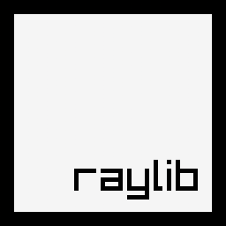

# raylib-d [](https://code.dlang.org/packages/raylib-d)
(static) D bindings for [raylib](https://www.raylib.com/), a simple and easy-to-use library to learn videogames programming.

*Note: this is a resurrected copy of the original raylib-d. The original author, onroundit (Petro Romanovych) deleted his github acccount. Therefore, some links in this README are broken, and some of the history is lost for good. I will accept any PRs that fix broken links or replace original data, but the code history itself is intact.*

# Installation
`dub add raylib-d`

## First, get a copy of Raylib
You can get the library by compiling it from the [source](https://github.com/raysan5/raylib), download the [official precompiled binaries](https://github.com/raysan5/raylib/releases). The local copies of binaries are no longer available, as that history was lost.

*WARNING*: Make sure you get the correct copy of the raylib library based on the version of raylib-d! Getting the incorrect version will cause SILENT compatibility errors, including memory corruption. It is extremely important to match these together.

If you depend on raylib-d vX.Y.Z, then your raylib binary should be vX.Y.0. Note that so far, raylib has never had point releases, but raylib-d may have them. Note that raylib-d version 3.1.0 is matched against raylib version 3.7.0, but should probably never have been tagged that way. There is an equivalent 3.7.0 tag now.

For example, if you depend on raylib-d version `v3.0.x`, then you should download raylib version `3.0.0`. If you depend on raylib-d version `3.7.x`, then you should download raylib version `3.7.0`.

#### Linux/Mac:

You must make raylib visible to the linkage binder. CD into the extracted raylib folder.

Now we must make raylib visible to the compiler and linker system wide. Simply run the following.
```
sudo mv lib/* /usr/local/lib/
```

Linux users must also update the linker with this command:
```
sudo ldconfig
```

#### Windows:
On Windows you must drag and drop all the required library files into the root directory of your project. These are `raylib.dll`, `raylib.lib`, and `raylibdll.lib`.

## In order to link against raylib, add it to your dub.json.
#### Using version 4.0.0 as an example.
### On Linux/Mac:
```json
"dependencies": { "raylib-d": "~>4.0.0" },
"libs": [ "raylib" ],
```

### On Windows:
Starting with `4.0.0`, raylib includes 2 windows linker files, `raylib.lib` for static linking (not recommended) and `raylibdll.lib` for dynamic linking. Even though the dll is called `raylib.dll`, use the `raylibdll` for the linker file to link dynamically.
```json
"dependencies": { "raylib-d": "~>4.0.0" },
"libs": [ "raylibdll" ],
```


(*Note: this is missing, but may be available from wayback machine*)

For more information look into the [wiki](https://github.com/onroundit/raylib-d/wiki/Installation).

# Example
```D
import raylib;

void main()
{
	InitWindow(800, 600, "Hello, Raylib-D!");
	while (!WindowShouldClose())
	{
		BeginDrawing();
		ClearBackground(Colors.RAYWHITE);
		DrawText("Hello, World!", 400, 300, 28, Colors.BLACK);
		EndDrawing();
	}
	CloseWindow();
}
```

*Note: this is missing, but may be available from wayback machine*

# [Docs / cheatsheet](https://github.com/onroundit/raylib-d/wiki/Docs-(cheatsheet))

# License
raylib-d is licensed under an unmodified zlib/libpng license. View [LICENSE](LICENSE).
